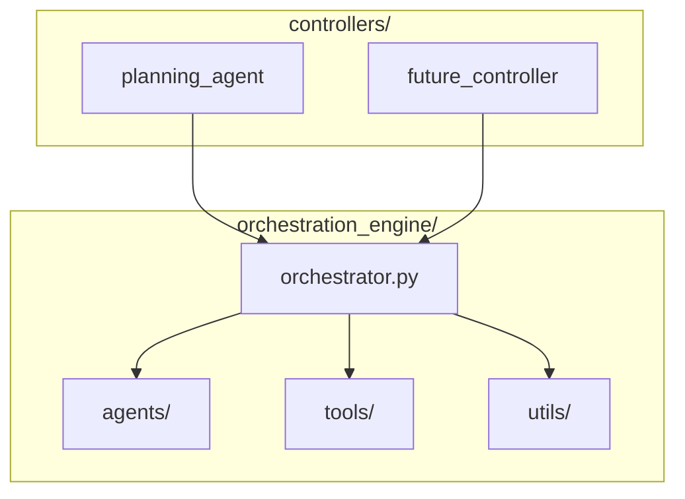

# Agent SRE Architecture

This project has been refactored to separate concerns between the reusable orchestration engine and high-level controllers.

## Directory Structure

```
agent_sre/
├── orchestration_engine/          # Reusable orchestration library
│   ├── __init__.py                # Main exports
│   ├── orchestrator.py           # Core orchestrator logic
│   ├── agents/                   # Execution agents (qa, query, etc.)
│   ├── tools/                    # Available tools (calculator, search, etc.)
│   ├── utils/                    # Core utilities
│   ├── schemas/                  # Data schemas
│   └── services/                 # External services
├── controllers/                  # High-level controllers
│   ├── __init__.py
│   └── planning_agent/           # Planning-based controller
│       ├── __init__.py
│       └── simple_agent.py       # Main planning logic
├── knowledge_base_sre/           # Domain knowledge
├── docs/                         # Documentation
└── example_usage.py              # Usage example
```

## Architecture Principles

### Orchestration Engine
- **Purpose**: Reusable execution engine for SRE automation
- **Responsibilities**: Tool management, agent coordination, execution context
- **Dependencies**: None (self-contained)
- **Exports**: Core classes and utilities for building controllers

### Controllers
- **Purpose**: High-level decision makers that use the orchestration engine
- **Responsibilities**: Planning, workflow coordination, domain-specific logic
- **Dependencies**: Orchestration engine
- **Examples**: Planning agent, reactive agent, scheduled maintenance agent

## Dependency Flow



## Usage Examples

### Basic Planning Agent Usage

```python
from openai import OpenAI
from orchestration_engine import OrchestratorCore, ConfigManager, ToolManager
from controllers.planning_agent import SimplePlanningAgent

# Initialize engine
config = ConfigManager.load_configuration()
tool_manager = ToolManager(config)
orchestrator_core = OrchestratorCore(config, tool_manager)

# Create controller
planning_agent = SimplePlanningAgent(
    orchestrator_core=orchestrator_core,
    client=OpenAI(),
    model="gpt-4"
)

# Execute workflow
result = planning_agent.execute_plan(alert, context)
```

### Creating New Controllers

To create a new controller:

1. Create a new directory under `controllers/`
2. Import from `orchestration_engine` (not the other way around)
3. Use `OrchestratorCore` for execution
4. Follow the established patterns for context and execution

Example structure for a new controller:

```python
from orchestration_engine import OrchestratorCore, ExecutionContext

class MyController:
    def __init__(self, orchestrator_core: OrchestratorCore):
        self.orchestrator_core = orchestrator_core
    
    def execute_workflow(self, inputs):
        context = ExecutionContext(...)
        return self.orchestrator_core.execute_with_context(context)
```

## Benefits

1. **Separation of Concerns**: Engine vs. controllers have clear responsibilities
2. **Reusability**: Orchestration engine can be used by multiple controllers
3. **Extensibility**: Easy to add new controllers without modifying the engine
4. **Testability**: Components can be tested independently
5. **Maintainability**: Clear dependency flow and module boundaries

## Migration Notes

- All imports from `orchestration_agent` should now use `orchestration_engine`
- Planning logic moved from `orchestration_agent/planning/` to `controllers/planning_agent/`
- The orchestration engine is now a proper Python package with clear exports
- Controllers are organized separately and can be developed independently

## Key Components

### Orchestration Engine Exports

```python
from orchestration_engine import (
    OrchestratorCore,           # Main execution engine
    ConfigManager,              # Configuration management
    ToolManager,                # Tool registry and management
    ExecutionContext,           # Execution context for workflows
    ContextAccumulator,         # Context accumulation utilities
    PlanningCapableOrchestrator # Interface for planning-capable orchestrators
)
```

### Planning Agent Controller

```python
from controllers.planning_agent import SimplePlanningAgent

# The planning agent creates multi-step plans and executes them
# using the orchestration engine
```

This architecture provides a clean separation between the execution engine and the decision-making controllers, making the system more modular and extensible.