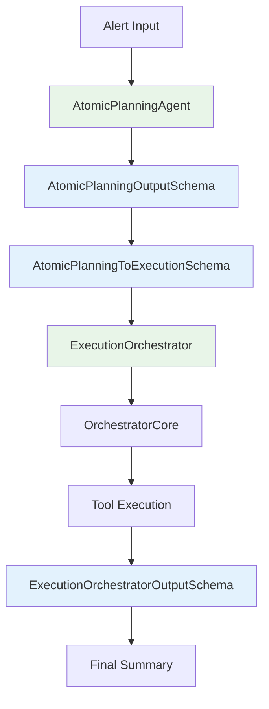

# Planning Agent with Atomic Agents

This module provides a modern SRE incident planning and execution system built with the Atomic Agents framework.

## Architecture Overview

The planning agent uses **Atomic Agents** architecture with clear separation of concerns:

- **Planning**: [`atomic_planning_agent.py`](atomic_planning_agent.py) - Pure planning with structured outputs
- **Execution**: [`execution_orchestrator.py`](execution_orchestrator.py) - Pure execution logic
- **Schemas**: [`planner_schemas.py`](planner_schemas.py) - Structured I/O contracts
- **Orchestration**: [`atomic_executor.py`](atomic_executor.py) - Complete workflow coordination

## Quick Start

### Basic Usage

```python
from controllers.planning_agent import (
    create_atomic_planning_agent,
    ExecutionOrchestrator,
    AtomicPlanningInputSchema,
    ExecutionOrchestratorInputSchema
)
import instructor
import openai
import os

# 0. Create a shared client (ensure api_key is available)
api_key = os.getenv("OPENAI_API_KEY") # Example
shared_client = instructor.from_openai(openai.OpenAI(base_url="https://openrouter.ai/api/v1", api_key=api_key))

# 1. Create atomic planning agent
planning_agent = create_atomic_planning_agent(shared_client, model="gpt-4")

# 2. Generate structured plan
planning_result = planning_agent.run(AtomicPlanningInputSchema(
    alert="Your system alert here",
    context="System context information"
))

# 3. Execute plan (requires orchestrator setup)
execution_orchestrator = ExecutionOrchestrator(orchestrator_core)
execution_result = execution_orchestrator.run(
    ExecutionOrchestratorInputSchema(plan=simple_plan)
)
```

### Complete Workflow

```python
from controllers.planning_agent import process_alert_with_atomic_planning

# One-line execution of complete workflow
result = process_alert_with_atomic_planning(
    alert="Critical: Service 'api-gateway' returning 500 errors",
    context="Production API Gateway, error rate: 15%",
    model="gpt-4"
)

print(f"Success: {result.success}")
print(f"Steps executed: {len(result.plan.steps)}")
print(f"Summary: {result.summary}")
```

## File Structure

```
controllers/planning_agent/
├── README.md                          # This file
├── __init__.py                        # Module exports
├── planner_schemas.py                 # Pydantic schemas
│
├── # Atomic Agents Implementation  
├── atomic_planning_agent.py           # Pure planning agent
├── execution_orchestrator.py          # Pure execution logic
├── atomic_executor.py                 # Atomic workflow orchestration
│
└── # Testing & Demo
    ├── test_atomic_components.py      # Component tests
    └── demo_atomic_agents.py          # Architecture demo
```

## Key Components

### 1. AtomicPlanningAgent

**Purpose**: Generate structured SRE incident response plans

**Features**:
- Uses Instructor for guaranteed structured outputs
- Follows SRE best practices (investigate → diagnose → resolve)
- Generates 3-5 actionable steps with reasoning
- Fully testable and debuggable

**Input Schema**:
```python
class AtomicPlanningInputSchema(BaseIOSchema):
    alert: str = Field(..., description="The system alert to create a plan for")
    context: str = Field(..., description="Contextual information about the system")
```

**Output Schema**:
```python
class AtomicPlanningOutputSchema(BaseIOSchema):
    steps: List[PlanStepSchema] = Field(..., description="Generated plan steps (3-5)")
    reasoning: str = Field(..., description="Planning approach and rationale")
```

### 2. ExecutionOrchestrator

**Purpose**: Execute plans step-by-step using the orchestration engine

**Features**:
- Pure execution logic (no planning)
- Context accumulation across steps
- Detailed step-by-step results
- Error handling and recovery

**Input Schema**:
```python
class ExecutionOrchestratorInputSchema(BaseIOSchema):
    plan: SimplePlanSchema = Field(..., description="The plan to execute")
```

**Output Schema**:
```python
class ExecutionOrchestratorOutputSchema(BaseIOSchema):
    executed_steps: List[StepExecutionResult] = Field(...)
    final_summary: str = Field(...)
    success: bool = Field(...)
    accumulated_knowledge: str = Field(...)
```

### 3. Schema-Based Chaining

Components are connected through matching schemas:

```python
# Planning output → Execution input
planning_result = planning_agent.run(planning_input)
bridge_schema = AtomicPlanningToExecutionSchema(
    alert=alert,
    context=context,
    steps=planning_result.steps,
    reasoning=planning_result.reasoning
)
simple_plan = bridge_schema.to_simple_plan()
execution_result = execution_orchestrator.run(
    ExecutionOrchestratorInputSchema(plan=simple_plan)
)
```

## Running Examples

### 1. Test Components

```bash
# Test individual atomic components
python controllers/planning_agent/test_atomic_components.py
```

### 2. Explore Architecture

```bash
# Interactive demo of atomic agents features
python controllers/planning_agent/demo_atomic_agents.py
```

### 3. Run Complete Workflow

```bash
# Run atomic agents workflow
python controllers/planning_agent/atomic_executor.py
```

## Benefits of Atomic Agents Architecture

### 🔍 **Transparency**
- Clear input/output contracts for every component
- No hidden "magic" or black boxes
- Easy to understand data flow

### 🧪 **Testability**
- Unit test each atomic component independently
- Mock inputs/outputs with Pydantic schemas
- Isolated testing of planning vs execution logic

### 🐛 **Debuggability**
- Set breakpoints on specific atomic components
- Inspect exact schemas at each step
- Clear separation of concerns

### 🔧 **Modularity**
- Swap planning strategies without changing execution
- Replace execution engines without touching planning
- Mix and match components as needed

### 📊 **Reliability**
- Guaranteed structured outputs with Instructor
- Pydantic validation catches schema errors
- Consistent data formats across components

### 🔗 **Composability**
- Chain components through schema matching
- Build complex workflows from simple atoms
- Reuse components in different contexts

## Architecture Diagram



## Configuration

### Environment Variables

```bash
# Required for planning agent
export OPENAI_API_KEY="your-openai-api-key"

# Optional model selection
export PLANNING_MODEL="gpt-4"  # Default: gpt-4
```

### Dependencies

The atomic agents implementation requires:

```toml
atomic-agents = "^1.1.2"
instructor = "^1.6.1"
pydantic = ">=2.10.3,<3.0.0"
openai = ">=1.35.12,<2.0.0"
```

## Best Practices

### 1. **Use Type Hints**
```python
def process_alert(input_data: AtomicPlanningInputSchema) -> AtomicPlanningOutputSchema:
    return planning_agent.run(input_data)
```

### 2. **Validate Schemas**
```python
# Always validate inputs
input_schema = AtomicPlanningInputSchema(alert=alert, context=context)
result = planning_agent.run(input_schema)
assert isinstance(result, AtomicPlanningOutputSchema)
```

### 3. **Handle Errors Gracefully**
```python
try:
    result = planning_agent.run(input_schema)
except Exception as e:
    logger.error(f"Planning failed: {e}")
    # Implement fallback logic
```

### 4. **Test Components Independently**
```python
def test_planning_agent():
    # shared_client = instructor.from_openai(openai.OpenAI(base_url="https://openrouter.ai/api/v1", api_key=api_key)) # Example
    agent = create_atomic_planning_agent(shared_client, model)
    result = agent.run(test_input)
    assert len(result.steps) >= 3
    assert result.reasoning is not None
```

## Troubleshooting

### Common Issues

1. **Schema Validation Errors**
   - Check that all required fields are provided
   - Ensure field types match schema definitions
   - Validate nested objects (e.g., PlanStepSchema)

2. **API Key Issues**
   - Verify OPENAI_API_KEY is set correctly
   - Check API key permissions and quotas
   - Test with a simple OpenAI call first

3. **Import Errors**
   - Ensure atomic-agents is installed: `pip install atomic-agents`
   - Check Python path includes the project root
   - Verify all dependencies are installed

### Debug Mode

Enable debug logging:

```python
import logging
logging.basicConfig(level=logging.DEBUG)

# Run with verbose output
result = planning_agent.run(input_schema)
```

## Contributing

When adding new atomic components:

1. **Follow the IPO Pattern**: Input Schema → Process → Output Schema
2. **Inherit from BaseIOSchema**: Use Pydantic for all schemas
3. **Add Tests**: Create unit tests for each component
4. **Document Schemas**: Add clear field descriptions
5. **Update __init__.py**: Export new components

## Example Scenarios

The system handles various SRE scenarios:

### 1. Database Issues
```python
result = process_alert_with_atomic_planning(
    alert="Critical failure: 'ExtPluginReplicationError: Code 7749 - Sync Timeout with AlphaNode'",
    context="Primary PostgreSQL Database (Version 15.3). Plugin: experimental-geo-sync-plugin v0.1.2"
)
```

### 2. Kubernetes Problems
```python
result = process_alert_with_atomic_planning(
    alert="Pod CrashLoopBackOff for service 'checkout-service'",
    context="Kubernetes microservice (Java Spring Boot). Memory: 512Mi, CPU: 0.5 core"
)
```

### 3. API Gateway Issues
```python
result = process_alert_with_atomic_planning(
    alert="API endpoint /api/v2/orders returning 503 Service Unavailable",
    context="API Gateway (Kong) and backend OrderService. Error rate: 5%"
)
```

## Future Enhancements

- [ ] Add streaming support for real-time plan generation
- [ ] Implement plan validation and optimization
- [ ] Add support for conditional execution flows
- [ ] Create specialized planning agents for different incident types
- [ ] Add metrics and observability for planning performance
- [ ] Support for multi-step plan dependencies
- [ ] Integration with external monitoring systems
