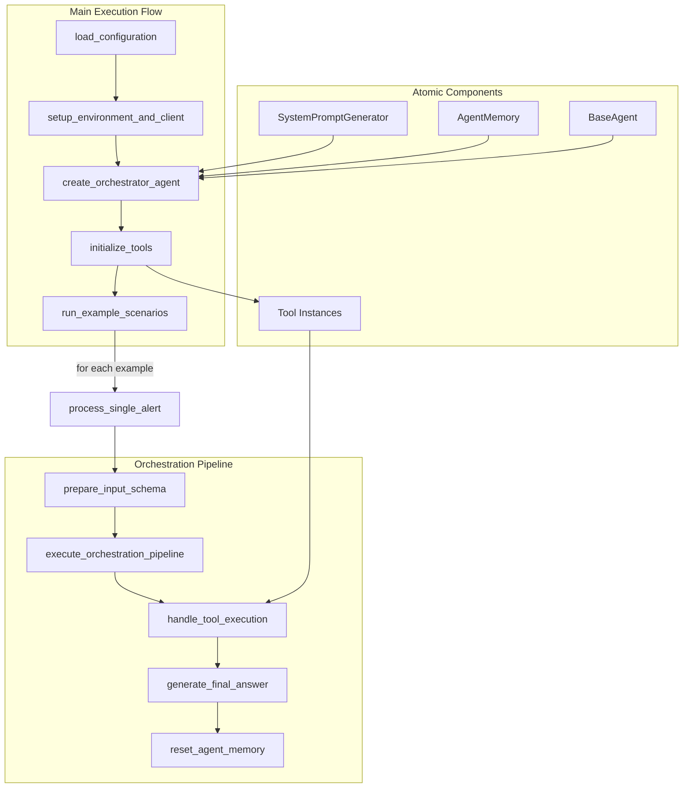

# Orchestrator Refactoring Plan

## Overview

This document outlines the plan for refactoring the `orchestration_agent/orchestrator.py` file, focusing on extracting code from the `if __name__ == "__main__"` block into modular, reusable functions. The refactoring follows the atomic-agents philosophy, creating clear separation of concerns and a developer-friendly architecture that facilitates integration with other agents in the SRE project.

## Core Principles

The refactoring adheres to these core principles from the atomic-agents philosophy:

1. **Input-Process-Output (IPO) Model**: Each function has clearly defined inputs and outputs
2. **Atomicity**: Each function does one thing and does it well
3. **Modularity**: Single-purpose building blocks that can be combined
4. **Predictability**: Strict input/output schemas for consistent results
5. **Developer Experience**: Readable, maintainable, and easy to debug

## Proposed Function Structure

### Configuration Management

```python
def load_configuration():
    """Load configuration settings from environment variables or config files."""
    # Reference: Lines 144-147 in orchestrator.py (environment loading)
    # Reference: Lines 149-161 in orchestrator.py (tool configuration)
    
    config = {
        "openai_api_key": os.getenv("OPENAI_API_KEY"),
        "model": os.getenv("MODEL_NAME", "gpt-4o-mini"),
        "searxng_base_url": os.getenv("SEARXNG_BASE_URL", "http://localhost:8080"),
        "knowledge_base_dir": os.path.join(os.path.dirname(__file__), "..", "knowledge_base_sre"),
        "persist_dir": os.path.join(os.path.dirname(__file__), "..", "sre_chroma_db"),
        "recreate_rag_collection": False,
        "force_reload_rag_docs": False,
        "max_search_results": 3
    }
    return config
```

### Environment Setup

```python
def setup_environment_and_client(config):
    """Set up environment variables and initialize the OpenAI client."""
    # Reference: Lines 30-32 in orchestrator.py (load_dotenv)
    # Reference: Line 147 in orchestrator.py (client initialization)
    
    load_dotenv()  # Load environment variables
    client = instructor.from_openai(openai.OpenAI(api_key=config["openai_api_key"]))
    return client
```

### Agent Creation

```python
def create_orchestrator_agent(client, model_name):
    """Create and configure the orchestrator agent instance."""
    # Reference: Lines 85-108 in orchestrator.py (agent definition)
    # Reference: Lines 110-111 in orchestrator.py (context provider registration)
    
    # Create system prompt generator (use existing from lines 89-103)
    system_prompt_generator = SystemPromptGenerator(
        background=[
            # Copy existing background from lines 90-95
        ],
        output_instructions=[
            # Copy existing instructions from lines 96-102
        ],
    )
    
    # Create and configure the agent (similar to lines 85-108)
    agent = BaseAgent(
        BaseAgentConfig(
            client=client,
            model=model_name,
            system_prompt_generator=system_prompt_generator,
            input_schema=OrchestratorInputSchema,
            output_schema=OrchestratorOutputSchema,
        )
    )
    
    # Register context providers (from lines 110-111)
    agent.register_context_provider("current_date", CurrentDateProvider("Current Date"))
    
    return agent
```

### Tool Initialization

```python
def initialize_tools(config):
    """Initialize all required tools with their configurations."""
    # Reference: Lines 149-161 in orchestrator.py (tool initialization)
    
    # Initialize SearxNG search tool
    searxng_tool = SearxNGSearchTool(
        SearxNGSearchToolConfig(
            base_url=config["searxng_base_url"], 
            max_results=config["max_search_results"]
        )
    )
    
    # Initialize calculator tool
    calculator_tool = CalculatorTool(CalculatorToolConfig())
    
    # Initialize RAG search tool
    rag_tool_config = RAGSearchToolConfig(
        docs_dir=config["knowledge_base_dir"],
        persist_dir=config["persist_dir"],
        recreate_collection_on_init=config["recreate_rag_collection"],
        force_reload_documents=config["force_reload_rag_docs"]
    )
    rag_tool = RAGSearchTool(config=rag_tool_config)
    
    return {
        "searxng": searxng_tool,
        "calculator": calculator_tool,
        "rag": rag_tool
    }
```

### Input Preparation

```python
def prepare_input_schema(alert_data):
    """Convert raw alert data into a properly formatted input schema."""
    # Reference: Line 194 in orchestrator.py
    
    return OrchestratorInputSchema(
        system_alert=alert_data["alert"], 
        system_context=alert_data["context"]
    )
```

### Orchestration Execution

```python
def execute_orchestration_pipeline(agent, input_schema):
    """Run the orchestrator agent to determine which tool to use."""
    # Reference: Line 202 in orchestrator.py
    
    return agent.run(input_schema)
```

### Tool Execution

```python
def handle_tool_execution(orchestrator_output, tools):
    """Execute the appropriate tool based on the orchestrator's decision."""
    # Reference: Line 212 in orchestrator.py
    # Reference: Lines 114-131 for the execute_tool function
    
    # This function uses the existing execute_tool function
    return execute_tool(
        tools["searxng"], 
        tools["calculator"], 
        tools["rag"], 
        orchestrator_output
    )
```

### Final Answer Generation

```python
def generate_final_answer(agent, input_schema, tool_response):
    """Generate a final answer based on the tool's output."""
    # Reference: Lines 227-229 in orchestrator.py
    
    # Temporarily change the output schema
    original_schema = agent.output_schema
    agent.output_schema = FinalAnswerSchema
    
    # Add tool response to memory
    agent.memory.add_message("system", tool_response)
    
    # Generate final answer
    final_answer = agent.run(input_schema)
    
    # Restore original schema
    agent.output_schema = original_schema
    
    return final_answer
```

### Memory Management

```python
def reset_agent_memory(agent):
    """Reset the agent's memory for the next interaction."""
    # Reference: Line 234 in orchestrator.py
    
    agent.memory = AgentMemory()
```

### Process Single Alert

```python
def process_single_alert(agent, tools, alert_data, console, generate_final_answer_flag=False):
    """Process a single alert through the complete orchestration pipeline."""
    # Reference: Lines 191-234 in orchestrator.py
    
    # Display the alert
    console.print(Panel(
        f"[bold cyan]System Alert:[/bold cyan] {alert_data['alert']}\n"
        f"[bold cyan]System Context:[/bold cyan] {alert_data['context']}",
        expand=False
    ))
    
    # Prepare input schema
    input_schema = prepare_input_schema(alert_data)
    
    # Print the input schema
    console.print("\n[bold yellow]Generated Input Schema:[/bold yellow]")
    input_syntax = Syntax(
        str(input_schema.model_dump_json(indent=2)), 
        "json", 
        theme="monokai", 
        line_numbers=True
    )
    console.print(input_syntax)
    
    # Execute orchestration pipeline
    orchestrator_output = execute_orchestration_pipeline(agent, input_schema)
    
    # Print the orchestrator output
    console.print("\n[bold magenta]Orchestrator Output:[/bold magenta]")
    orchestrator_syntax = Syntax(
        str(orchestrator_output.model_dump_json(indent=2)), 
        "json", 
        theme="monokai", 
        line_numbers=True
    )
    console.print(orchestrator_syntax)
    
    # Execute the selected tool
    tool_response = handle_tool_execution(orchestrator_output, tools)
    
    # Print the tool output
    console.print("\n[bold green]Tool Output:[/bold green]")
    output_syntax = Syntax(
        str(tool_response.model_dump_json(indent=2)), 
        "json", 
        theme="monokai", 
        line_numbers=True
    )
    console.print(output_syntax)
    
    console.print("\n" + "-" * 80 + "\n")
    
    # Optionally generate final answer
    if generate_final_answer_flag:
        final_answer = generate_final_answer(agent, input_schema, tool_response)
        console.print(f"\n[bold blue]Final Answer:[/bold blue] {final_answer.final_answer}")
    
    # Reset memory for next interaction
    reset_agent_memory(agent)
```

### Run Example Scenarios

```python
def run_example_scenarios(agent, tools, example_data, console, generate_final_answer=False):
    """Run through a list of example scenarios."""
    # Reference: Lines 166-219 in orchestrator.py
    
    # Print the full system prompt
    console.print(Panel(
        agent.system_prompt_generator.generate_prompt(), 
        title="System Prompt", 
        expand=False
    ))
    console.print("\n")
    
    # Process each example
    for alert_input in example_data:
        process_single_alert(
            agent=agent,
            tools=tools,
            alert_data=alert_input,
            console=console,
            generate_final_answer_flag=generate_final_answer
        )
```

## Main Execution Flow

```python
if __name__ == "__main__":
    # Load configuration
    config = load_configuration()
    
    # Set up environment and client
    openai_client = setup_environment_and_client(config)
    
    # Create orchestrator agent
    agent = create_orchestrator_agent(
        client=openai_client,
        model_name=config["model"]
    )
    
    # Initialize tools
    tool_instances = initialize_tools(config)
    
    # Initialize Rich console
    from rich.console import Console
    from rich.panel import Panel
    from rich.syntax import Syntax
    console_instance = Console()
    
    # Define example data
    example_alerts = [
        # Copy existing examples from lines 171-188
    ]
    
    # Run example scenarios
    run_example_scenarios(
        agent=agent,
        tools=tool_instances,
        example_data=example_alerts,
        console=console_instance,
        generate_final_answer=True  # Set to False to skip final answer generation
    )
```

## Architecture Diagram



## Implementation Notes

1. **Imports**: Keep all necessary imports from the original file at the top
2. **Existing Code**: The `execute_tool` function (lines 114-131) can remain largely unchanged
3. **Schemas**: All schema definitions (`OrchestratorInputSchema`, `OrchestratorOutputSchema`, `FinalAnswerSchema`) should remain at the top of the file
4. **Context Providers**: The `CurrentDateProvider` class should remain unchanged

## Next Steps

1. Implement the refactored functions as outlined
2. Update imports if any new modules are needed
3. Test the refactored code with the example scenarios
4. Consider adding unit tests for each atomic function
5. Document the new structure for team members

By following this plan, you'll create a flexible orchestration layer that adheres to atomic-agents principles and can be extended as your agent ecosystem grows.